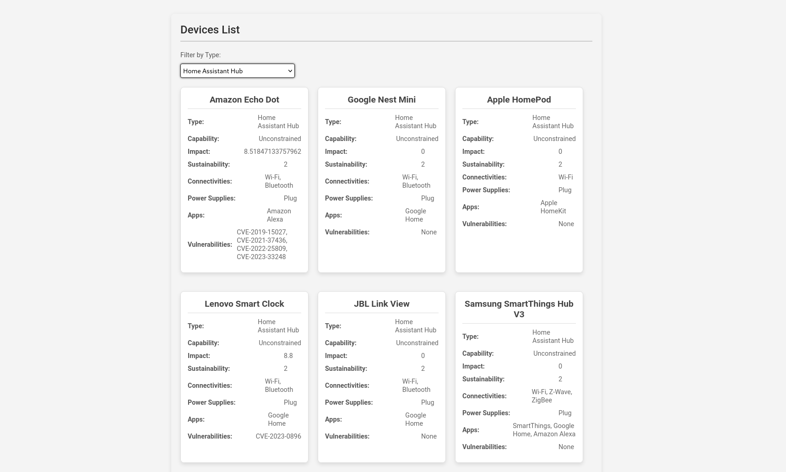
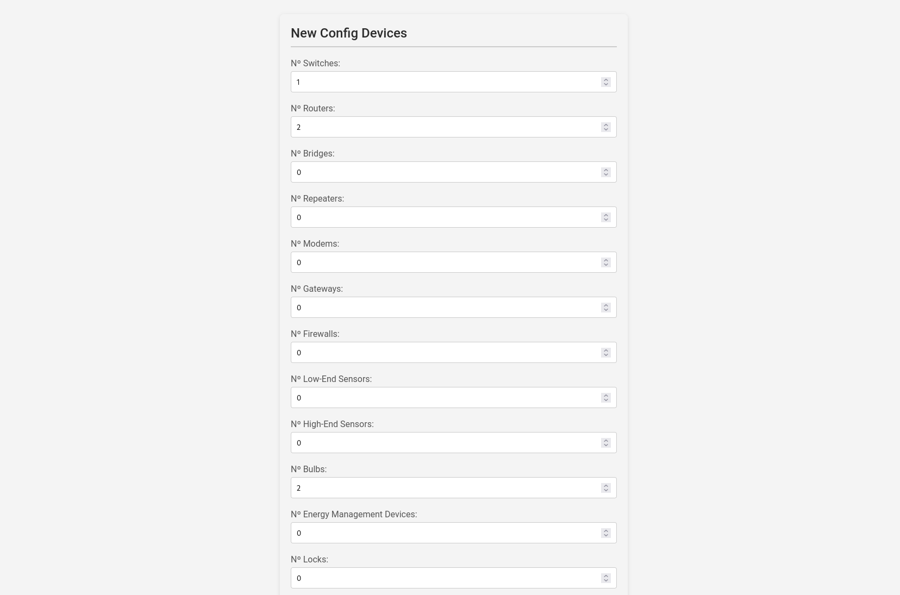
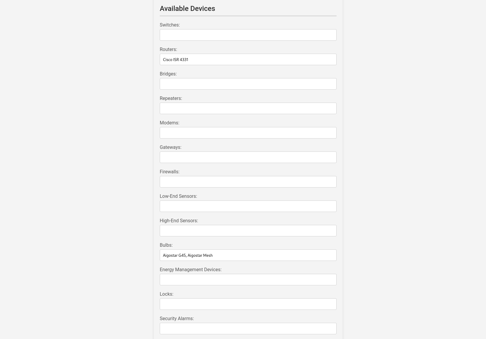
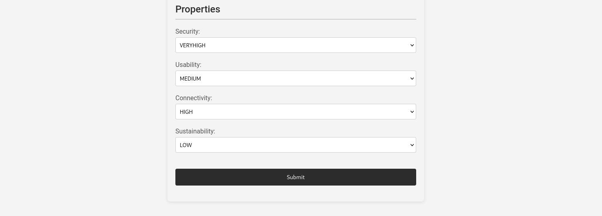
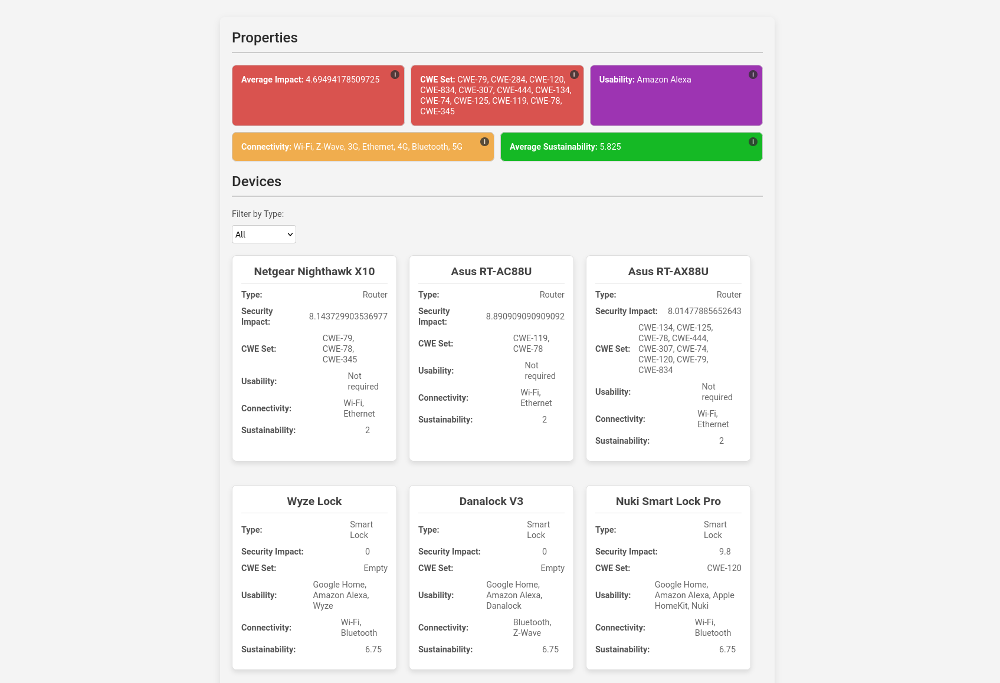
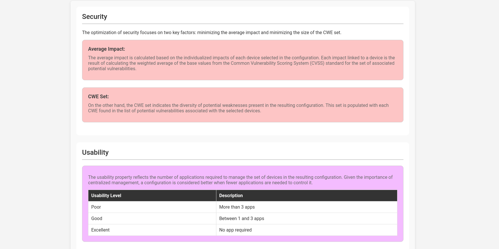
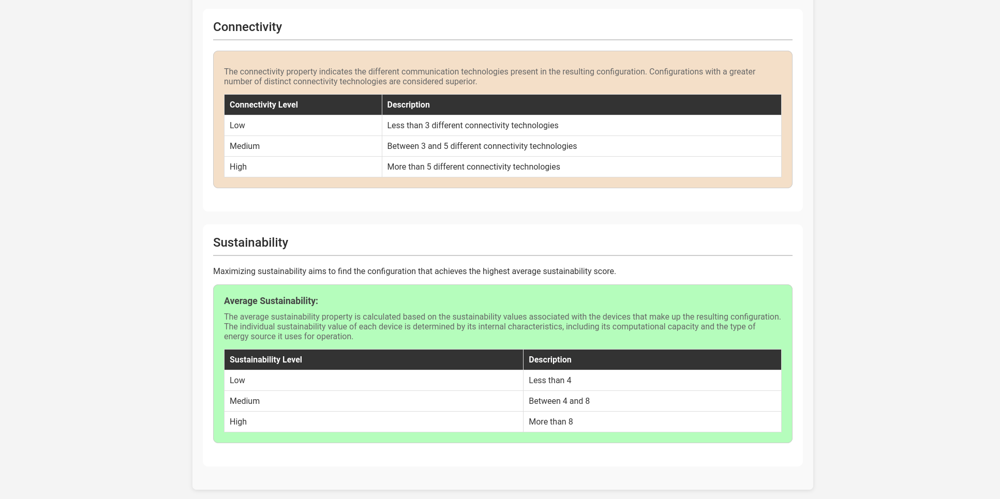

# ALBA - Assistant
## Overview
Alba-Assistant is a decision support tool designed to generate secure and sustainable smart home configurations. It leverages a multi‐objective optimization approach that balances security, connectivity, sustainability, and usability based on user defined requirements. Using constraint programming techniques alongside up-to-date device data and vulnerability information, Alba Assistant computes the best combination of smart devices to meet the user’s specific needs while ensuring ease of integration, enhanced safety and energy efficiency.

## Installation
1. A local copy of the Alba-Assitant repository is obtained:
   ```
    git clone https://github.com/DMUNNOZ/ALBA.git
    ```
2. The API and the web client must be instantiated independently.

3. In order to instantiate the API, the following steps must be completed:
    ```
    cd albacsp
    ```
   ```
    python3 manage.py runserver
    ```

5. Once the API is up, the web client can be launched to facilitate direct interaction with the API:
    ```
    cd alba_client/albacsp
    ```
   ```
    npm run dev
    ```
7. Finally, access to the client is available at the following route:
      ```
    http://localhost:5173
    ```

## Devices view
In the devices view, all the devices stored in the database can be listed along with their detailed attributes. This view includes a variety of filters that allow users to refine the displayed information based on specific criteria.



## Create configuration view
The configuration view serves as the main function of the tool. Here, users can specify both the number and types of devices to add to their configuration. Additionally, they can designate which specific devices should appear directly in the configuration, and assign a level of importance to each objective. This enables the creation of smart home configurations that precisely reflect the user's priorities, balancing key aspects such as security, usability, connectivity, and sustainability.







## Obtained configuration

After processing the request, the optimal smart home configuration is displayed to the user. This view shows both the selected devices and a concise summary of the resulting values for the objectives.




## Property information
Additionally, the tool offers a help view that explains the function of each objective and outlines the range of possible returned values. This feature aids users in interpreting the output and understanding how each objective contributes to the overall configuration.





